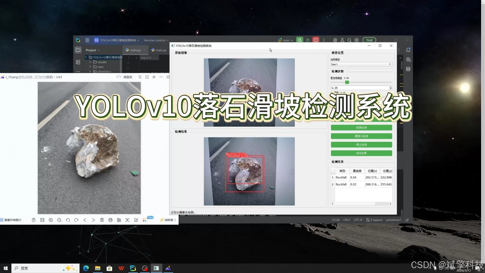
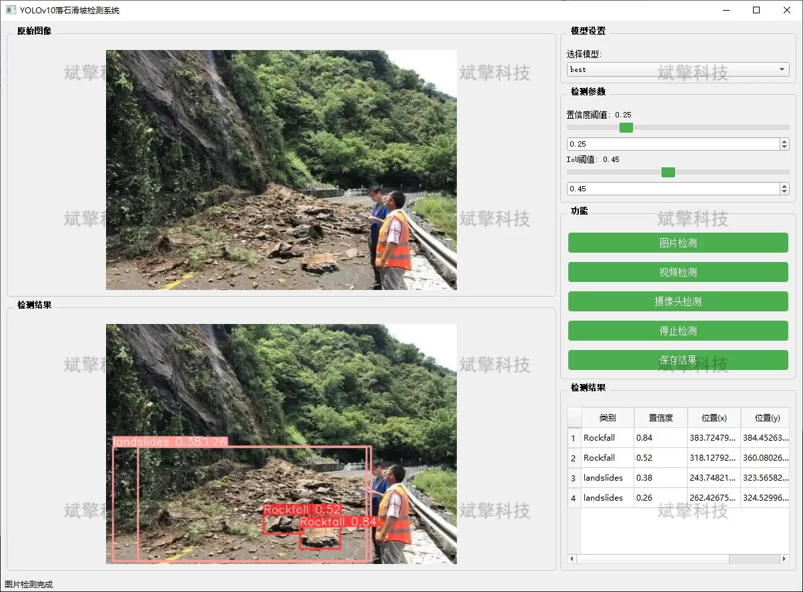
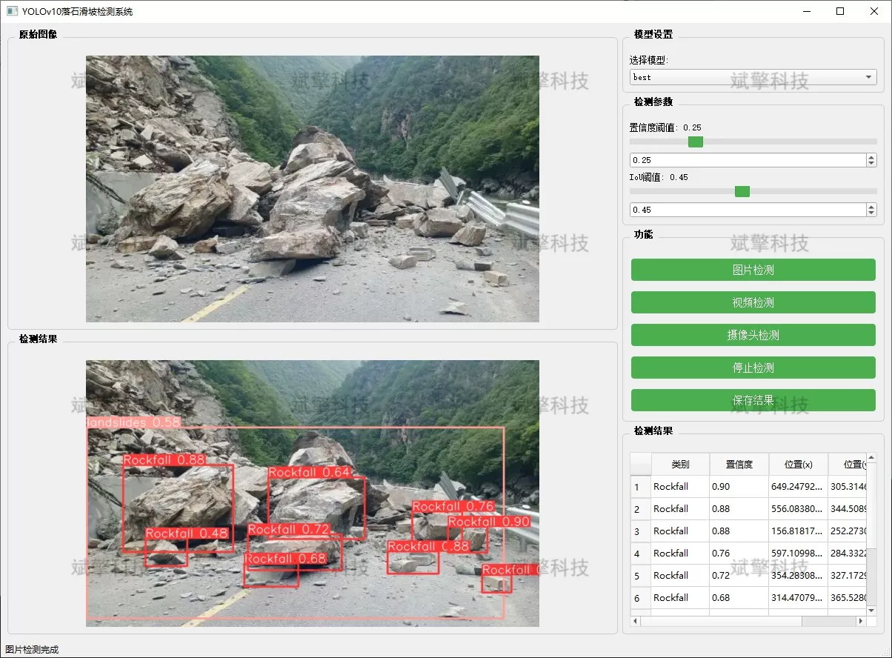
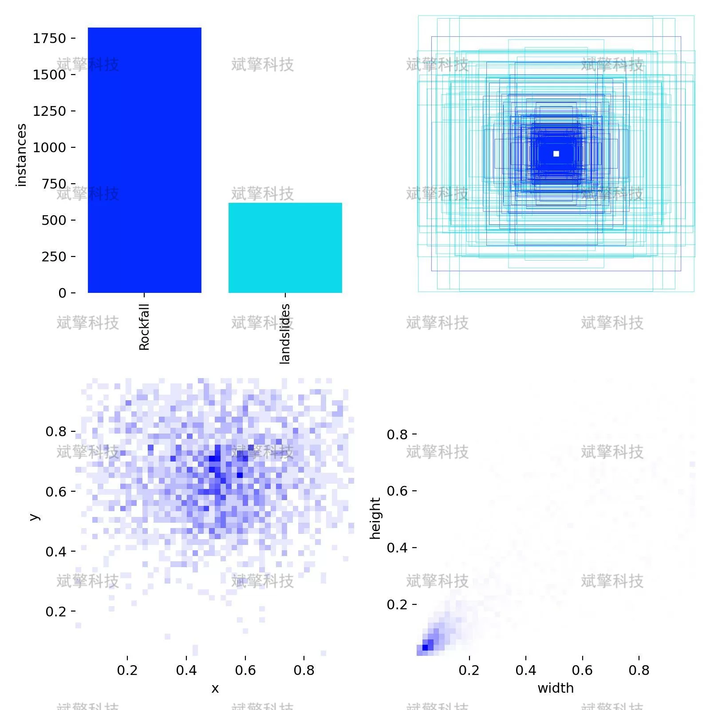
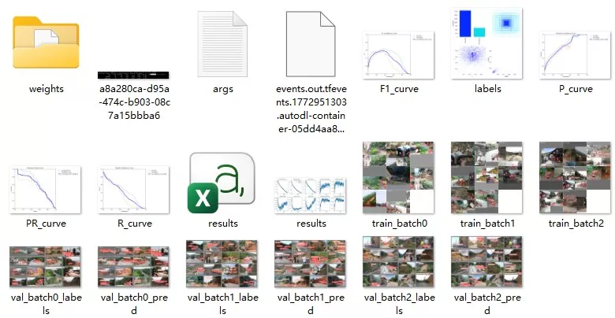
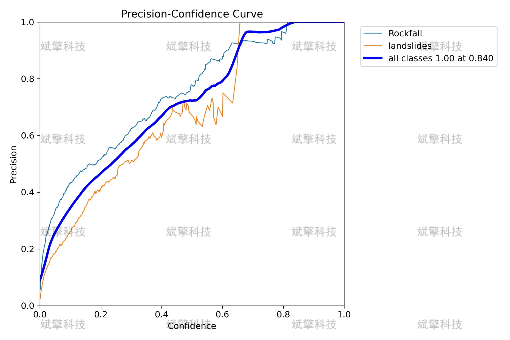
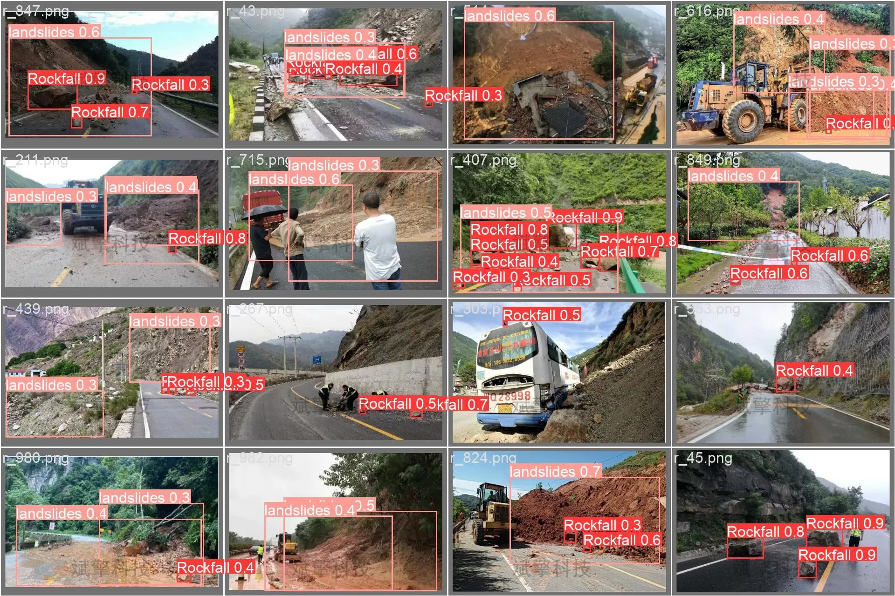

# YOLOv10 Landslide Detection System

## Body

The YOLOv10 Falling Stone and Landslide Detection System, based on the latest YOLOv10 object detection algorithm, has been developed to create an efficient intelligent detection system for falling stones and landslides.

The system includes three major functional modules: image detection, video detection, and real-time camera detection, capable of quickly and accurately identifying both falling stones (Rockfall) and landslides (Landslides). Experimental results show that the system performs well in complex geological environments, providing reliable technical support for early warning and emergency response to geological disasters.

System Features
✅ Image Detection: Capable of detecting images and returning detection boxes and category information.
✅ Video Detection: Supports input of video files, detecting the situation in each frame of the video.
✅ Real-time Camera Detection: Connects a USB camera to achieve real-time monitoring.
✅ Real-time parameter adjustment (confidence and IoU thresholds)
Dataset Introduction
Training set: 810 images
Validation set: 90 images
Test set: 100 images

## Images

## Payment

Here is a pay link on Stripe ( https://buy.stripe.com/3cs8yP7sY87d0vu9AB ). Please contact me lonlonago@foxmail.com after funding $89, and I will send you a complete data files , thank you!

